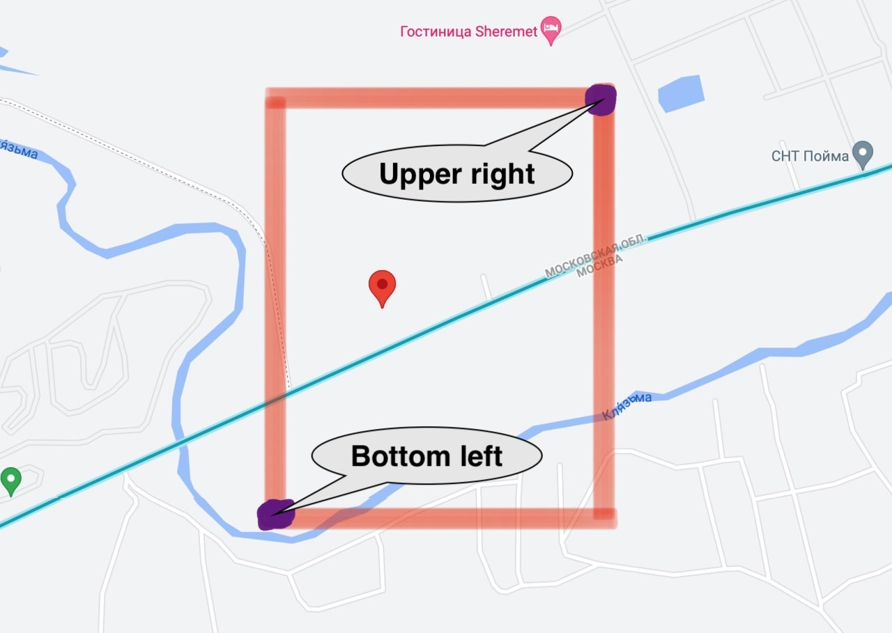
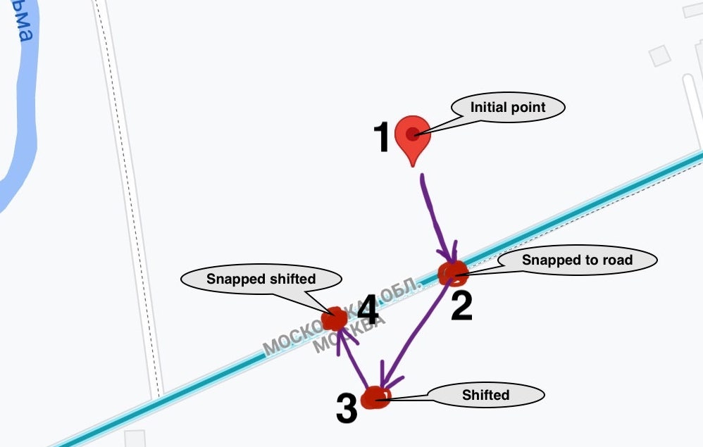

## Google Streetview  Panoramas Collection

<u>Description</u>: this code is intended to collect a dataset of images from Google Streets View. More details will be discussed below.

---

1. Firstly, we use uniform distribution to select point from rectangular between bottom left and upper right point:

2. Then we need to snap selected point to road
3. We are ready to request street view image, but also we need to specify angle of head look (0...360), so next steps will focus on calculating direction of road (compass bearing)
4. Lets shift snapped point N.2 to random direction with random value and get point N.3
5. Snap shifted point N.3 to closest road and get point N.4, we "hope" that this point will be snapped to the same road as point N.2



6. We use points N.4 and N.2 to get difference between their latitude and longitude and calculate compass bearing using elementary triangle geometry (see `geo_utils.py`)


---
#### Developer key

<u>Note</u>: you can't use Google Streets View Static Api without google developer key (you can find a way to get it by searching the internet)

To use custom key, overwrite function 
```python
def get_developer_key():
    pass
```
in file `google_developer_key.py`

---
#### Images collection process:
Open `processing.py` and edit last fragment of code:
```python
Processing.process_json(
    path_to_json='zones/coords_zones.json',
    root_path='collected_images/',
    proc_type='randomdirectional'
)
```
* `path_to_json` - path to json the file where zones are listed (see json file structure section below)
* `root_path` - If you are collecting dataset, path to collected images will be like: `'./root_path/label/...'`
* `proc_type` - we have two processing types:
    1. `'randomdirectional'` - collecting 9 images from one position with rotating shift 40 degrees (e.g. heading will be 0, 40, 80, 120, 160, 200, 240, 280, 320)
    2. `'multidirectional'` - when directions specified:
        * Forward heading
        * Backward heading
        * Left heading
        * Right heading
    
    Note: you can edit and tune both of them in `processing.py`


---
#### Json file structure:
```json
{
    "zones": [
        {
            "bottom_left": [lat, lng],
            "upper_right": [lat, lng],
            "num": ...,
            "is_processed": false,
            "label": ...,
            "description": "..."
        },
        ...
    ]
}
```
* `lat`, `lng` - latitude, longitude
* `bottom_left` - point of rectangular for point selection
* `upper_right` - same meaning as `bottom_left`
* `num` - numer of randomly selected points you want to process
* `label` - class label for street view from point (e.g. village, city, ...)
* `description` - optional, for understanding meaning of current rectangular
----